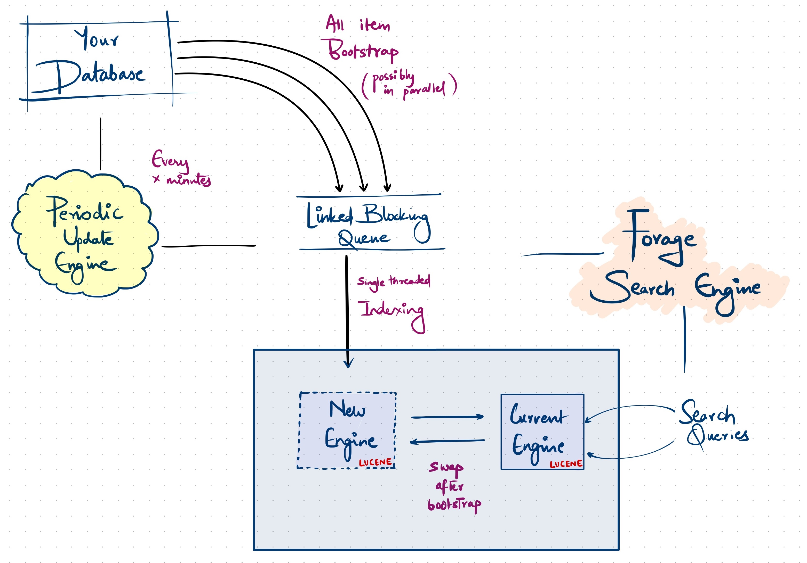
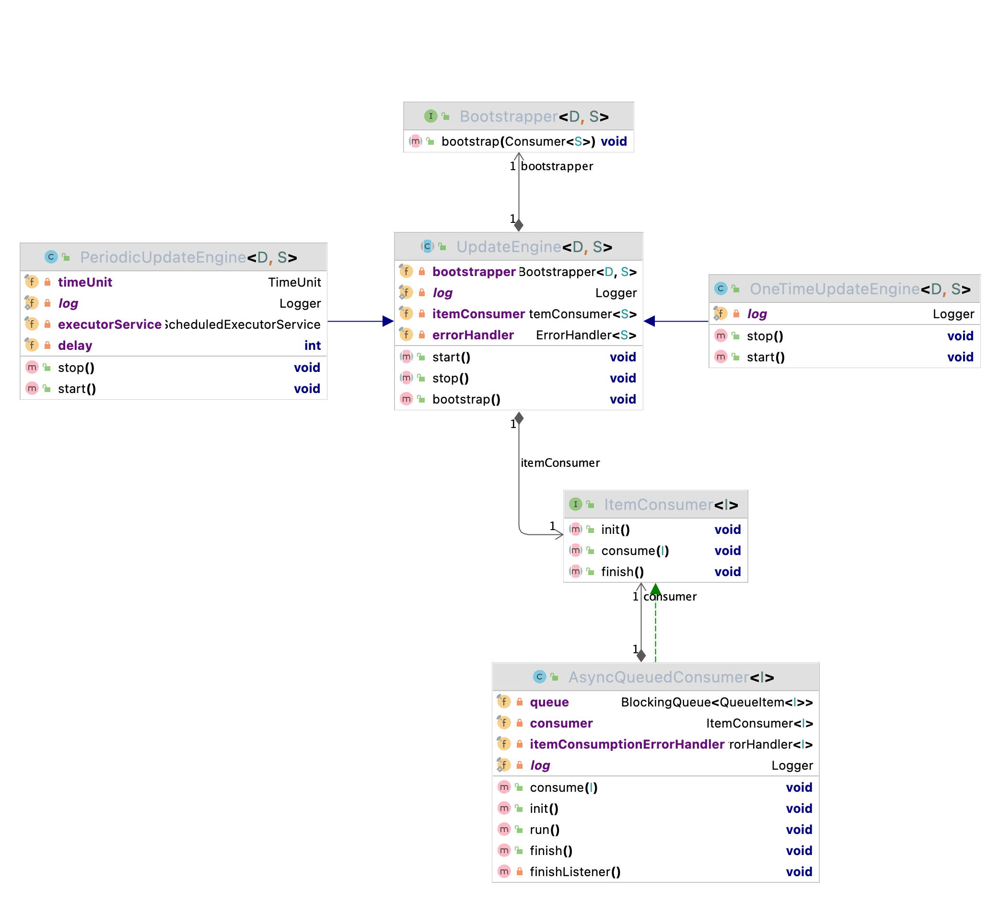

<p align="center">
  
  <h1 align="center">Forage</h1>
  <p align="center">In-memory Search made Easy<p>
  <p align="center">
    <a href="https://github.com/livetheoogway/forage/actions">
    	
    </a>
    <a href="https://s01.oss.sonatype.org/content/repositories/releases/com/livetheoogway/forage/">
    	
    </a>
    <a href="https://github.com/livetheoogway/forage/blob/master/LICENSE">
    	
    </a>
  </p>
  <p align="center">
    <a href="https://sonarcloud.io/project/overview?id=livetheoogway_forage">
    	
    </a>
    <a href="https://sonarcloud.io/project/overview?id=livetheoogway_forage">
    	
    </a>
    <a href="https://sonarcloud.io/project/overview?id=livetheoogway_forage">
    	
    </a>
    <a href="https://sonarcloud.io/project/overview?id=livetheoogway_forage">
    	
    </a>
  </p>
</p>

## What is it?

A library that helps you build an in-memory search index, out of the data residing in your database/persistence layer.
This should be possible as long as you are able to pipe data out of the persistence layer, into your application.

## Why would it be required?

Say you have small amount of data in your primary datastore, but you want simple search capabilities on top of this
data, would you spin up an entire search engine for this? Like a dedicated Elasticsearch or Solr? Or would you start
creating indexes left and right, and bloat up your database? You would still not be able to do free text search on it,
if you wanted to.

There are some obvious problems with whatever approach you take:

1. Overkill: It is definitely an overkill in most use-cases, like the times when your database has only a few 1000 rows
2. Expensive: Depending on what hardware/cloud you choose to use to host the search engine
3. Latencies: Search engines today are really fast (especially if you provision on the hardware), but whatever you do,
   you still incur the network hop cost.

The library attempts to solve the above, by creating a simple search index, in every application node's memory.

## How it works?

The following is a high level sketch of what is happening:



We've finished the _What_ and the _Why_, now let's look at the _How_.<br>
At its heart is [Lucene](https://lucene.apache.org/). Why lucene you ask? Well, lucene is the most evolved open-source
java search engine libraries out there. It powers Nutch, Solr, Elasticsearch etc. It is well maintained,
supported by the Apache Software Foundation, and has continuous contributions. Need I say more?!

Now how do you make your database searchable?<br>
Essentially, the problem can be divided into 4 critical steps:

1. Bootstrapping: Ship all data from your database and index it in Lucene
2. Periodic Update: Do this at regular intervals (to account for changes in your database)
3. Indexing Rules: Be able to define what parts of the Data, what fields, you want indexed in Lucene
4. Search Queries: Be able to retrieve documents by querying the indexed fields.

#### 1. Bootstrapping from your database:

This is where we retrieve all data elements from your database and send it to the Consumer.
Your DAO layer, should implement a `Bootstrapper` class, and its `bootstrap()` method is where you would scan your
persistence layer. In this method, you can call the `consumer.consumer()` method, for all those data items you want
indexed in the search engine.

- The consumer handles parallel callbacks
- it also ensures single threaded processing of those callbacks (ie, indexing into lucene)

#### 2. Periodic Update

You can define how often the full bootstrap happens. A `PeriodicUpdateEngine` ensures that the bootstrapping process is
called at regular intervals. The interval is configurable, based on what you think is right for your use-case.

#### 3. Indexing Rules

You should be able to decide which of the fields are being indexed. As such, the `Bootstrapper`
implementation's `Consumer` takes in a `IndexableDocument`, where-in, you can choose how the item is indexed as a
document. The examples in the Usage section, should make this more clear.

#### 4. Search Queries

You should be able to express your retrieval strategies, using the `ForageQuery` class.
There are several static helpers in `QueryBuilder` which should make things easy when constructing the query.

## Any prerequisites and callouts?

- One important prerequisite is that, you should be able to pull all data from your database, ie, you should be able to
  stream it out as a batched select query (on your relational DB), or a scan (Aerospike, Redis, HBase or any other
  non-relational DB), depending on what database you are using.
- **Data Size Limitations**: Optimal for datasets with up to 1 million documents. While it depends on available heap memory, the library has been extensively tested with 100k-500k documents in memory.
- **Memory Requirements**: Ensure adequate heap space. As a rough estimate, allocate 2-4x the size of your raw data for optimal performance, accounting for Lucene indexes and document storage.

# Getting Started

## Quick Start

```java
// 1. Add Maven dependency
<dependency>
    <groupId>com.livetheoogway.forage</groupId>
    <artifactId>forage-search-engine</artifactId>
    <version>${forage.version}</version>
</dependency>

// 2. Create your data store
class BookStore implements Bootstrapper<IndexableDocument>, Store<Book> {
    public void bootstrap(Consumer<IndexableDocument> itemConsumer) {
        // Index your data 
        itemConsumer.accept(new ForageDocument(book.getId(), book, Arrays.asList(
            new TextField("title", book.getTitle()),
            new TextField("author", book.getAuthor()),
            new FloatField("rating", new float[]{book.getRating()})
        )));
    }
    
    public Map<String, Book> get(List<String> ids) {
        return fetchBooksFromDatabase(ids); // Your implementation
    }
}

// 3. Initialize search engine
SearchEngine<ForageQuery, ForageQueryResult<Book>> searchEngine = 
    new ForageEngine<>(ForageSearchEngineBuilder.<Book>builder()
        .withDataStore(bookStore)
        .withObjectMapper(new ObjectMapper()));

// 4. Search with advanced ranking
ForageQueryResult<Book> results = searchEngine.search(
    QueryBuilder.booleanQuery()
        .query(QueryBuilder.matchQuery("title", "java").build())
        .query(QueryBuilder.matchQuery("author", "gosling").boost(1.5f).build())
        .clauseType(ClauseType.SHOULD)
        .buildForageQuery(10, 
            Arrays.asList(SortCriteria.byScore(SortOrder.DESC)), 
            0.1f) // minimum score
);
```

## Detailed Setup

### Maven Dependency

```xml

<dependency>
    <groupId>com.livetheoogway.forage</groupId>
    <artifactId>forage-search-engine</artifactId>
    <version>${forage.version}</version> <!--look for the latest version on top-->
</dependency>
```

### Usage

Let's go the full mile and see what the complete integration would look like.
The sample shows how `Book` items stored in some database can be made searchable. Assume `Book` with typical properties
like (`title`, `author`, `rating`, `numPage`)

**Step 1**

You would typically start with your datastore/DAO implementations. The following is a good example of what it would look
like:

```java
import java.util.HashMap;

class DataStore implements Bootstrapper<IndexableDocument>, Store<Book> {
    private final HashMap<String, Book> books; // This would be your DB connections

    public DataStore() {
        this.books = Lists.newArrayList();  // You would be initializing your DB connections here
    }

    public void saveBook(final Book book) {
        books.put(book.getId(), book);  // You would be saving this in your database
    }

    @Override
    public void bootstrap(final Consumer<IndexableDocument> itemConsumer) {
        
        // THIS IS THE MAIN IMPLEMENTATION
        
        for (final Book book : books) {
          // You would scan all rows of your database here, and create individual ForageDocument and supply to the consumer
          // All rules on which fields need to be indexed how, should be happening here
          // You can optionally boost important fields during indexing
          itemConsumer.accept(new ForageDocument(book.getId(), book, Arrays.asList(
                        new TextField("title", book.getTitle()),
                        new TextField("author", book.getAuthor()),  
                        new TextField("description", book.getDescription()),
                        new FloatField("rating", new float[]{book.getRating()}),
                        new IntField("numPage", new int[]{book.getNumPage()}))));
        }
    }

    // The following function will be called during search operations.
    // This is to get the current stored data for the matching doc ids during the search operation, you just have to replace 
    // this with the implementation that retrieves the ids from your actual datastore
    @Override
    public Map<String, Book> get(final List<String> ids) {
        return ids.stream().map(id -> MapEntry.of(id, books.get(id))).collect(MapEntry.mapCollector());
    }
}
```

**Step 2**

Your next steps, would involve creating and initializing the SearchEngine and using it for retrieval

```java

import java.awt.print.Book;

@Singleton
public class Container {

    private SearchEngine<ForageQuery, ForageQueryResult<Book>> searchEngine;

    public Container() {
        final ForageSearchEngineBuilder<Book> engineBuilder = ForageSearchEngineBuilder.<Book>builder()
                .withDataStore(dataStore)
                .withObjectMapper(new ObjectMapper());

        this.searchEngine = new ForageEngine<>(engineBuilder);

        final PeriodicUpdateEngine<IndexableDocument> updateEngine =
                new PeriodicUpdateEngine<>(
                        dataStore,
                        new AsyncQueuedConsumer<>(searchEngine),
                        60, TimeUnit.SECONDS // depicts how often you want to bootstrap from the database
                );

        updateEngine.start();
    }

    // And while searching, you can do this:
    public void sampleSearch() {

        // Basic search: retrieve top 10 books that have numPages between 600 and 1000
        final ForageQueryResult<Book> results =
                searchEngine.search(QueryBuilder.intRangeQuery("numPage", 600, 800).buildForageQuery(10));   

        // Boolean search: retrieve all books that have "rowling" in Author, and "prince" in Title
        ForageQueryResult<Book> result = searchEngine.search(
                QueryBuilder.booleanQuery()
                        .query(new MatchQuery("author", "rowling"))
                        .query(new MatchQuery("title", "prince"))
                        .clauseType(ClauseType.MUST)
                        .buildForageQuery());

        // Advanced search with boosting and sorting
        List<SortCriteria> sortBy = Arrays.asList(
            SortCriteria.byScore(SortOrder.DESC),           // Sort by relevance first
            new SortCriteria("rating", SortOrder.DESC)      // Then by rating
        );
        
        ForageQueryResult<Book> boostedResult = searchEngine.search(
                QueryBuilder.booleanQuery()
                        .query(QueryBuilder.matchQuery("title", "java").boost(2.0f).build())  // Boost title matches
                        .query(QueryBuilder.matchQuery("author", "martin").boost(1.5f).build()) // Boost author matches  
                        .clauseType(ClauseType.SHOULD)
                        .buildForageQuery(10, sortBy, 0.1f));  // Minimum score threshold
    }
}
```

## Dropwizard Bundle

There is a much simple integration available if your application is a [Dropwizard](https://www.dropwizard.io/en/latest/)
application.

Add the following dependency

```xml

<dependency>
    <groupId>com.livetheoogway.forage</groupId>
    <artifactId>forage-dropwizard-bundle</artifactId>
    <version>${forage.version}</version> <!--look for the latest version on top-->
</dependency>
```

In your Application, register the `ForageBundle`

```java
public class MyApplication extends Application<MyConfiguration> {
    // other stuff
    @Override
    public void initialize(final Bootstrap<MyConfiguration> bootstrap) {
        bootstrap.addBundle(new ForageBundle<>() {

            @Override
            public Store<Book> dataStore(final MyConfiguration configuration) {
                return store;  // the one that retrieves data given id
            }

            @Override
            public Bootstrapper<IndexableDocument> bootstrap(final MyConfiguration configuration) {
                return store;  // the one that implements the bootstrap
            }

            @Override
            public ForageConfiguration forageConfiguration(final MyConfiguration configuration) {
                return configuration.getForageConfiguration(); // have ForageConfiguration as part of your main config class
            }
        });
    }
}

```

## Features

### Core Query Types

**1. Simple Term Match**
```java
QueryBuilder.matchQuery("title", "sawyer").buildForageQuery()
```

**2. Fuzzy Query** - Match similar terms with typos/variations
```java
QueryBuilder.fuzzyMatchQuery("title", "sayyer").buildForageQuery()
```

**3. Range Queries** - Numeric and date range filtering
```java
QueryBuilder.intRangeQuery("numPage", 600, 800).buildForageQuery()
QueryBuilder.floatRangeQuery("rating", 4.0f, 5.0f).buildForageQuery()
```

**4. Boolean Queries** - Complex query combinations
```java
QueryBuilder.booleanQuery()
        .query(new MatchQuery("author", "rowling"))
        .query(new MatchQuery("title", "prince"))
        .clauseType(ClauseType.MUST)  // or SHOULD, MUST_NOT, FILTER
        .buildForageQuery();
```

**5. Phrase Match Query** - Match exact phrases
```java
QueryBuilder.phraseMatchQuery("title", "Tom Sawyer").buildForageQuery();
```

**6. Prefix Match Query** - Match terms starting with prefix
```java
QueryBuilder.prefixMatchQuery("author", "row").buildForageQuery();
```

**7. Match All Query** - Return all documents
```java
QueryBuilder.matchAllQuery().buildForageQuery();
```

### Ranking & Scoring Overview

Forage layers several ranking primitives so you can blend lexical relevance with business signal weighting:

1. **Base Lucene score** – TF/IDF style scoring driven by the query.
2. **Query-time boosts** – emphasis on specific clauses or phrases.
3. **Function score multipliers** – numeric adjustments from doc-values or scripts.
4. **Sorting & minimum-score gating** – deterministic ordering and quality cutoffs.

#### Query-time Boosts
```java
QueryBuilder.booleanQuery()
        .query(QueryBuilder.matchQuery("title", "java").boost(2.0f).build())
        .query(QueryBuilder.matchQuery("content", "java").boost(1.0f).build())
        .clauseType(ClauseType.SHOULD)
        .buildForageQuery();
```
Mix and match boosts to express intent (e.g., exact title hit should outrank body mention).

#### Sorting & Secondary Keys
```java
List<SortCriteria> sortBy = Arrays.asList(
        SortCriteria.byScore(SortOrder.DESC),
        new SortCriteria("rating", SortOrder.DESC));

QueryBuilder.matchQuery("author", "martin").buildForageQuery(10, sortBy);
```
`SortCriteria` accepts a field, `SortOrder`, and `SortType`. Use `SortCriteria.byScore()` for pure relevance or specify doc-value backed fields for deterministic business ordering.

#### Minimum Score Filtering
```java
QueryBuilder.matchQuery("title", "programming")
        .buildForageQuery(10, null, 0.5f);
```
The third argument to `buildForageQuery` acts as a relevance gate—ideal for trimming fuzzy queries.

#### Function Scoring (Business Signals)
```java
ForageQuery fanFavorites = QueryBuilder.functionScoreQuery()
        .baseQuery(QueryBuilder.matchQuery("genre", "fantasy").build())
        .fieldValueFactor("rating", 1.2f)
        .boost(1.1f)
        .buildForageQuery(20, Arrays.asList(SortCriteria.byScore()), 0.25f);
```

| Score Function | Description | Example Usage |
| --- | --- | --- |
| `ConstantScoreFunction` | Multiplies every match with a fixed constant | `.constantScore(2.0f)` |
| `WeightedScoreFunction` | Simple weight for the overall query | `.scoreFunction(new WeightedScoreFunction(1.5f))` |
| `FieldValueFactorFunction` | Reads a numeric doc-value field | `.fieldValueFactor("popularity", 1.3f)` |
| `ScriptScoreFunction` | Executes a JavaScript expression with access to fields & `score` | `.scoreFunction(new ScriptScoreFunction("score * rating - numPage / 100"))` |
| `RandomScoreFunction` | Deterministic shuffle with seed/field | `.scoreFunction(new RandomScoreFunction(42L, "id"))` |
| `DecayFunction` | Linear/exp/log decay across numeric fields | `.scoreFunction(new DecayFunction(0, 365, 0, 0.5, DecayType.EXPONENTIAL, "daysSinceRelease"))` |

Doc-values are emitted automatically for `FloatField`, `IntField`, and `StringField`, so you can safely reference them in scripts, sorts, or field-value factors.

#### Full Ranking Recipe
```java
ForageQuery personalized = QueryBuilder.functionScoreQuery()
        .baseQuery(
                QueryBuilder.booleanQuery()
                        .query(QueryBuilder.matchQuery("title", "java").boost(3.0f).build())
                        .query(QueryBuilder.matchQuery("tags", "backend").build())
                        .clauseType(ClauseType.SHOULD)
                        .build())
        .scoreFunction(new ScriptScoreFunction("score * rating + (5 - daysSinceRelease)"))
        .boost(1.05f)
        .buildForageQuery(
                15,
                Arrays.asList(SortCriteria.byScore(), new SortCriteria("popularity", SortOrder.DESC)),
                0.2f);
```
This example:
- prioritizes exact “java” title hits,
- mixes in a recency/rating script,
- sorts by relevance then popularity,
- and drops low-score matches via `minimumScore`.

### Pagination

**Page Queries and Paginated Results**
```java
// First page
ForageQueryResult<Book> result = searchEngine.search(
    QueryBuilder.matchQuery("author", "rowling").buildForageQuery(15)
);

// Next page
ForageQueryResult<Book> result2 = searchEngine.search(
    new PageQuery(result.getNextPage(), 20)
);
```

## Tech Dependencies

- Java 17
- Lucene 9.12.3
- Dropwizard 2.1.0 (Optional)

## Contributions

Please raise Issues, Bugs or any feature requests at [Github Issues](https://github.com/livetheoogway/forage/issues)
. <br>
If you plan on contributing to the code, fork the repository and raise a Pull Request back here.

## Under the Hood


(todo)

0. Core and the bootstrapper diagram with the queued listeners
1. Lucene internals being masked
2. Searchers
3. Attributes being stored for field conversion

## Feature Roadmap

### ✅ Completed
- [x] Helpers for query creation
- [x] Fuzzy Query Support  
- [x] Dropwizard bundle for simpler integrations
- [x] Phrase Query Support
- [x] Prefix Match Query Support
- [x] **Query-level Scoring and Boosting**
- [x] **Custom Sorting (by score, field values)**
- [x] **Minimum Score Filtering**
- [x] **Function Scoring (field value factors, constant scores)**

### 🚧 In Progress
- [ ] Enhanced Function Scoring (advanced mathematical functions)
- [ ] Multi-field boosting strategies
- [ ] Score normalization options

### 📋 Planned
- [ ] Off-Heap index storage support
- [ ] Auto complete query Support
- [ ] Expose explain query (IndexSearcher.explain)
- [ ] Query performance analytics
- [ ] Embeddings and vector search
- [ ] Geo-spatial queries

## Performance & Best Practices

### Indexing Performance
- Minimize the number of analyzed text fields for better indexing speed
- Consider batch indexing for large datasets

### Query Performance  
- Use specific queries (MatchQuery, PrefixQuery) over broad queries (MatchAllQuery) when possible
- Apply minimum score filtering to reduce result processing overhead
- Use pagination for large result sets
- Cache frequently used queries

### Memory Management
- Monitor heap usage with large document sets
- Consider the trade-off between search speed and memory consumption
- Use appropriate field types (StringField vs TextField) based on search requirements
