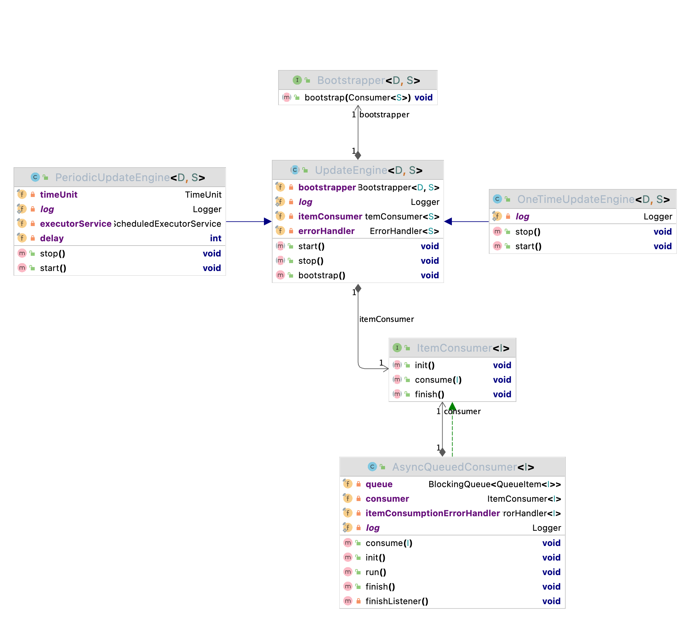

<p align="center">
  
  <h1 align="center">Forage</h1>
  <p align="center">In-memory Search made Easy<p>
  <p align="center">
    <a href="https://github.com/livetheoogway/forage/actions">
    	
    </a>
    <a href="https://s01.oss.sonatype.org/content/repositories/releases/com/livetheoogway/forage/">
    	
    </a>
    <a href="https://github.com/livetheoogway/forage/blob/master/LICENSE">
    	
    </a>
    <a href=".github/badges/jacoco.svg">
    	
    </a>
    <a href=".github/badges/branches.svg">
    	
    </a>
  </p>
</p>

## What is it?

A library that helps you build an in-memory search index, out of the data residing in your database/persistence layer.
This should be possible as long as you are able to pipe data out of the persistence layer, into your application.

## Why would it be required?

Say you have small amount of data in your primary datastore, but you want simple search capabilities on top of this
data, would you spin up an entire search engine for this? Like a dedicated Elasticsearch or Solr? Or would you start
creating indexes left and right, and bloat up your database? You would still not be able to do free text search on it,
if you wanted to.

There are some obvious problems with whatever approach you take:

1. Overkill: It is definitely an overkill in most use-cases, like the times when your database has only a few 1000 rows
2. Expensive: Depending on what hardware/cloud you choose to use to host the search engine
3. Latencies: Search engines today are really fast (especially if you provision on the hardware), but whatever you do,
   you still incur the network hop cost.

The library attempts to solve the above, by creating a simple search index, in every application node's memory.

## How it works?

The following is a high level sketch of what is happening:


We've finished the _What_ and the _Why_, now let's look at the _How_.<br>
At its heart is [Lucene](https://lucene.apache.org/). Why lucene you ask? Well, lucene is the most evolved open-source
java search engine libraries out there. It powers Nutch, Solr, Elasticsearch etc. It is well maintained,
supported by the Apache Software Foundation, and has continuous contributions. Need I say more?!

Now how do you make your database searchable?<br>
Essentially, the problem can be divided into 4 critical steps:

1. Bootstrapping: Ship all data from your database and index it in Lucene
2. Periodic Update: Do this at regular intervals (to account for changes in your database)
3. Indexing Rules: Be able to define what parts of the Data, what fields, you want indexed in Lucene
4. Search Queries: Be able to retrieve documents by querying the indexed fields.

#### 1. Bootstrapping from your database:

This is where we retrieve all data elements from your database and send it to the Consumer.
Your DAO layer, should implement a `Bootstrapper` class, and its `bootstrap()` method is where you would scan your
persistence layer. In this method, you can call the `consumer.consumer()` method, for all those data items you want
indexed in the search engine.

- The consumer handles parallel callbacks
- it also ensures single threaded processing of those callbacks (ie, indexing into lucene)

#### 2. Periodic Update

You can define how often the full bootstrap happens. A `PeriodicUpdateEngine` ensures that the bootstrapping process is
called at regular intervals. The interval is configurable, based on what you think is right for your use-case.

#### 3. Indexing Rules

You should be able to decide which of the fields are being indexed. As such, the `Bootstrapper`
implementation's `Consumer` takes in a `IndexableDocument`, where-in, you can choose how the item is indexed as a
document. The examples in the Usage section, should make this more clear.

#### 4. Search Queries

You should be able to express your retrieval strategies, using the `ForageQuery` class.
There are several static helpers in `QueryBuilder` which should make things easy when constructing the query.

## Any prerequisites and callouts?

- One important prerequisite is that, you should be able to pull all data from your database, ie, you should be able to
  stream it out as a batched select query (on your relational DB), or a scan (Aerospike, Redis, HBase or any other
  non-relational DB), depending on what database you are using.
- Size of data should be limited. While it totally depends on how much heap you supply to your java application,
  it presume it shouldn't be in the range of 10s of millions. This library has been tested for 100k rows in memory.
  (todo) mention details
- Ensure your application is supplied with sufficient memory. A ballpark for calculating the memory for your base java
  application is to (todo)

# Getting started

### Maven Dependency

```xml

<dependency>
    <groupId>com.livetheoogway.forage</groupId>
    <artifactId>forage-search-engine</artifactId>
    <version>${forage.version}</version> <!--look for the latest version on top-->
</dependency>
```

### Usage

Let's go the full mile and see what the complete integration would look like.
The sample shows how `Book` items stored in some database can be made searchable. Assume `Book` with typical properties
like (`title`, `author`, `rating`, `numPage`)

**Step 1**

You would typically start with your datastore/DAO implementations. The following is a good example of what it would look
like:

```java
import java.util.HashMap;

class DataStore implements Bootstrapper<IndexableDocument>, Store<Book> {
    private final HashMap<String, Book> books; // This would be your DB connections

    public DataStore() {
        this.books = Lists.newArrayList();  // You would be initializing your DB connections here
    }

    public void saveBook(final Book book) {
        books.put(book.getId(), book);  // You would be saving this in your database
    }

    @Override
    public void bootstrap(final Consumer<IndexableDocument> itemConsumer) {
        
        // THIS IS THE MAIN IMPLEMENTATION
        
        for (final Book book : books) {
          // You would scan all rows of your database here, and create individual ForageDocument and supply to the consumer
          // All rules on which fields need to be indexed how, should be happening here
          itemConsumer.accept(new ForageDocument(book.getId(), book, ImmutableList
                    .of(new TextField("title", book.getTitle()),
                        new TextField("author", book.getAuthor()),
                        new FloatField("rating", new float[]{book.getRating()}),
                        new IntField("numPage", new int[]{book.getNumPage()}))));
        }
    }

    @Override
    public Book get(final String id) {
        return books.get(id);
    }
}
```

**Step 2**

Your next steps, would involve creating and initializing the SearchEngine and using it for retrieval

```java

import java.awt.print.Book;

@Singleton
public class Container {

    private SearchEngine<ForageQuery, ForageQueryResult<Book>> searchEngine;

    public Container() {
        final ForageSearchEngineBuilder<Book> engineBuilder = ForageSearchEngineBuilder.<Book>builder()
                .withDataStore(dataStore)
                .withObjectMapper(new ObjectMapper());

        this.searchEngine = new ForageEngine<>(engineBuilder);

        final PeriodicUpdateEngine<IndexableDocument> updateEngine =
                new PeriodicUpdateEngine<>(
                        dataStore,
                        new AsyncQueuedConsumer<>(searchEngine),
                        60, TimeUnit.SECONDS // depicts how often you want to bootstrap from the database
                );

        updateEngine.start();
    }

    // And while searching, you can do this:
    public void sampleSearch() {

        // retrieve top 10 books that have numPages between 600 and 1000
        final ForageQueryResult<Book> results =
                searchEngine.search(QueryBuilder.intRangeQuery("numPage", 600, 800).buildForageQuery(10));   

        // retrieve all books that have "rowling" in Author, and "prince" in Title
        ForageQueryResult<Book> result = searchEngine.search(
                QueryBuilder.booleanQuery()
                        .query(new MatchQuery("author", "rowling"))
                        .query(new MatchQuery("title", "prince"))
                        .clauseType(ClauseType.MUST)
                        .buildForageQuery());
    }
}
```

## Dropwizard Bundle

There is a much simple integration available if your application is a [Dropwizard](https://www.dropwizard.io/en/latest/)
application.

Add the following dependency

```xml

<dependency>
    <groupId>com.livetheoogway.forage</groupId>
    <artifactId>forage-dropwizard-bundle</artifactId>
    <version>${forage.version}</version> <!--look for the latest version on top-->
</dependency>
```

In your Application, register the `ForageBundle`

```java
public class MyApplication extends Application<MyConfiguration> {
    // other stuff
    @Override
    public void initialize(final Bootstrap<MyConfiguration> bootstrap) {
        bootstrap.addBundle(new ForageBundle<>() {

            @Override
            public Store<Book> dataStore(final MyConfiguration configuration) {
                return store;  // the one that retrieves data given id
            }

            @Override
            public Bootstrapper<IndexableDocument> bootstrap(final MyConfiguration configuration) {
                return store;  // the one that implements the bootstrap
            }

            @Override
            public ForageConfiguration forageConfiguration(final MyConfiguration configuration) {
                return configuration.getForageConfiguration(); // have ForageConfiguration as part of your main config class
            }
        });
    }
}

```

## Features

1. Simple Term Match

```java
QueryBuilder.matchQuery("title","sawyer").buildForageQuery()
```

2. Fuzzy Query: You can try a fuzzy query match for retrieving results

```java
QueryBuilder.fuzzyMatchQuery("title","sayyer").buildForageQuery()
```

3. Range Queries

```java
QueryBuilder.intRangeQuery("numPage",600,800).buildForageQuery()
```

5. Boolean Queries

```java
QueryBuilder.booleanQuery()
        .query(new MatchQuery("author","rowling"))
        .query(new MatchQuery("title","prince"))
        .clauseType(ClauseType.MUST)  // or SHOULD, MUST_NOT, FILTER
        .buildForageQuery();

```

6. Page Queries and Paginated Results

```java
ForageQueryResult<Book> result = searchEngine.search(QueryBuilder.matchQuery("author", "rowling").buildForageQuery(15)); // first 15 items
ForageQueryResult<Book> result2 = searchEngine.search(new PageQuery(result.getNextPage(), 20)); // next 20 items
```

7. Phrase match query

```java
QueryBuilder.phraseMatchQuery("title", "Tom Sawyer").buildForageQuery();
```


8. All match query

```java
QueryBuilder.matchAllQuery().buildForageQuery();
```

## Tech Dependencies

- Java 11
- Lucene 9.1.0
- Dropwizard 2.1.0 (Optional)

## Contributions

Please raise Issues, Bugs or any feature requests at [Github Issues](https://github.com/livetheoogway/forage/issues)
. <br>
If you plan on contributing to the code, fork the repository and raise a Pull Request back here.

## Under the Hood


(todo)

0. Core and the bootstrapper diagram with the queued listeners
1. Lucene internals being masked
2. Searchers
3. Attributes being stored for field conversion

## Todos

- [x] Helpers for query creation
- [x] Fuzzy Query Support
- [x] Dropwizard bundle for simpler integrations
- [ ] Expose Scoring and boosting
- [x] Phrase Query Support
- [ ] Auto complete query Support
- [ ] Expose explain query IndexSearcher.explain(Query, doc)

