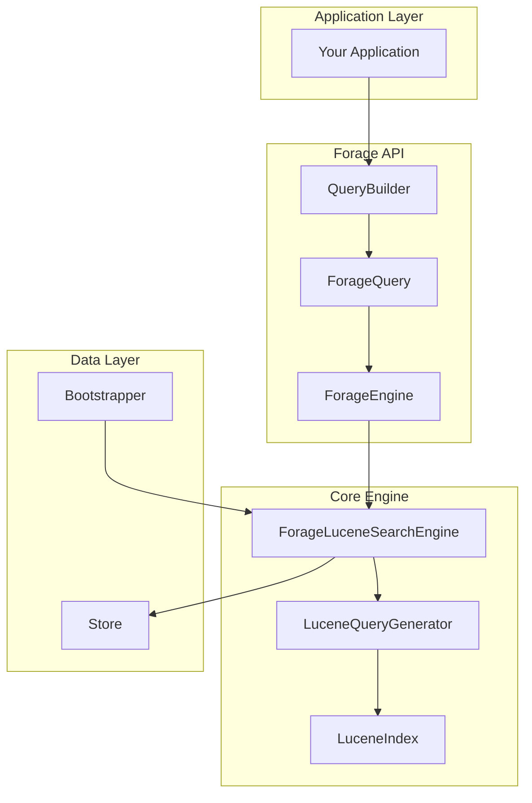
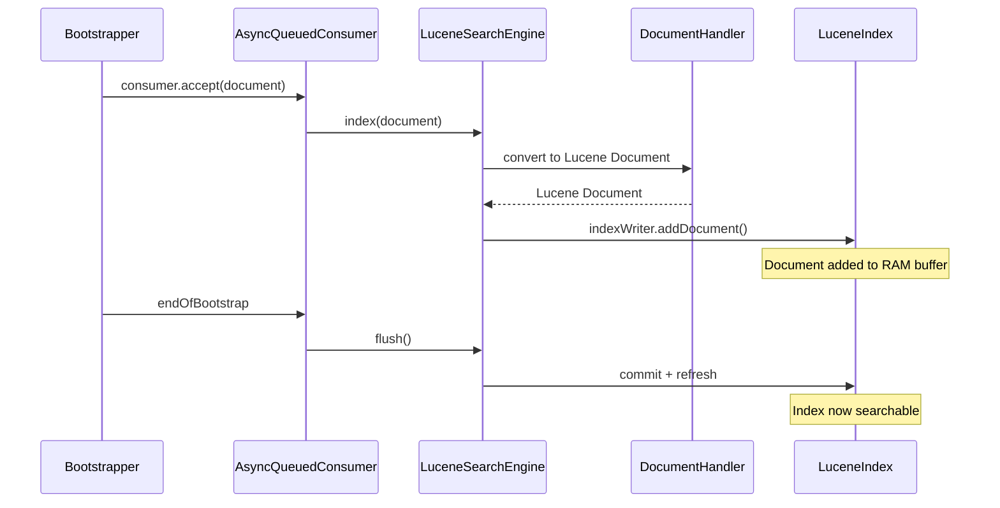
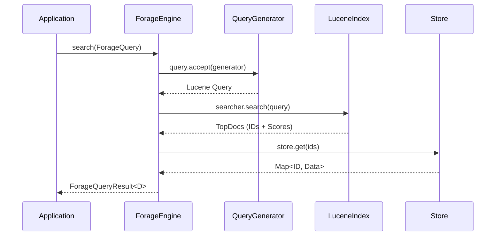
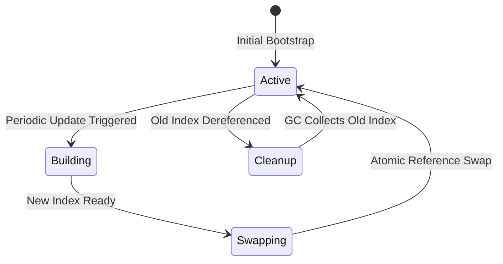

# Architecture

This document provides a deep dive into Forage's internal architecture.

## High-Level Architecture


## Component Overview



## Core Components

### ForageEngine

The main entry point that orchestrates search operations:

```java
public class ForageEngine<D> implements SearchEngine<ForageQuery, ForageQueryResult<D>> {

    private final ForageSearchEngine<D> searchEngine;

    @Override
    public ForageQueryResult<D> search(ForageQuery query) {
        return searchEngine.search(query);
    }

    @Override
    public void index(List<IndexableDocument> documents) {
        searchEngine.index(documents);
    }
}
```

### LuceneQueryGenerator

Converts Forage queries to native Lucene queries using the visitor pattern:

```java
public class LuceneQueryGenerator implements QueryVisitor<Query> {

    @Override
    public Query visit(MatchQuery matchQuery) {
        return new TermQuery(new Term(matchQuery.getField(), matchQuery.getValue()));
    }

    @Override
    public Query visit(BooleanQuery booleanQuery) {
        var builder = new org.apache.lucene.search.BooleanQuery.Builder();
        // ... build Lucene boolean query
        return builder.build();
    }

    @Override
    public Query visit(FunctionScoreQuery functionScoreQuery) {
        // Convert to Lucene FunctionScoreQuery with appropriate value source
    }
}
```

### LuceneIndex

Manages the in-memory Lucene index:

```java
public interface LuceneIndex {
    IndexWriter indexWriter();
    IndexSearcher searcher();
    DocRetriever docRetriever();
    void flush();
    void close();
}
```

## Data Flow

### Indexing Flow



### Search Flow



## Index Management

### Atomic Index Swap

During periodic updates, Forage creates a new index and atomically swaps it:



```java
public class SearchEngineSwapReferenceHandler {

    private final AtomicReference<ForageSearchEngine<D>> engineRef;

    public void swap(ForageSearchEngine<D> newEngine) {
        ForageSearchEngine<D> old = engineRef.getAndSet(newEngine);
        // Old engine becomes eligible for GC
        if (old != null) {
            old.close();
        }
    }
}
```

## Thread Safety

### Read Operations

Multiple threads can search simultaneously:

```java
// Thread-safe: Multiple concurrent searches
ExecutorService executor = Executors.newFixedThreadPool(10);
for (int i = 0; i < 100; i++) {
    executor.submit(() -> engine.search(query));
}
```

### Write Operations

The `AsyncQueuedConsumer` serializes writes:

```java
public class AsyncQueuedConsumer<T> implements Consumer<T> {

    private final BlockingQueue<T> queue = new LinkedBlockingQueue<>();

    @Override
    public void accept(T item) {
        queue.put(item);  // Thread-safe enqueue
    }

    // Single consumer thread processes the queue
    private void processQueue() {
        while (running) {
            T item = queue.take();
            indexer.index(item);  // Single-threaded indexing
        }
    }
}
```

## Query Processing Pipeline

```
User Query
    │
    ▼
┌─────────────────┐
│  QueryBuilder   │  Build type-safe query
└────────┬────────┘
         │
         ▼
┌─────────────────┐
│  ForageQuery    │  Abstract query representation
└────────┬────────┘
         │
         ▼
┌─────────────────┐
│ QueryGenerator  │  Convert to Lucene query
└────────┬────────┘
         │
         ▼
┌─────────────────┐
│  Lucene Query   │  Native Lucene query
└────────┬────────┘
         │
         ▼
┌─────────────────┐
│ IndexSearcher   │  Execute against index
└────────┬────────┘
         │
         ▼
┌─────────────────┐
│    TopDocs      │  Document IDs + Scores
└────────┬────────┘
         │
         ▼
┌─────────────────┐
│     Store       │  Fetch full documents
└────────┬────────┘
         │
         ▼
┌─────────────────┐
│ ForageResult    │  Combined results
└─────────────────┘
```

## Class Diagram


## Extension Points

### Custom Query Parser

```java
QueryParserFactory customFactory = field ->
    new QueryParser(field, new CustomAnalyzer());

ForageSearchEngineBuilder.<Book>builder()
    .withQueryParserFactory(customFactory)
    // ...
```

### Custom Analyzer

```java
Analyzer customAnalyzer = new Analyzer() {
    @Override
    protected TokenStreamComponents createComponents(String fieldName) {
        Tokenizer tokenizer = new StandardTokenizer();
        TokenStream filter = new LowerCaseFilter(tokenizer);
        filter = new StopFilter(filter, EnglishAnalyzer.ENGLISH_STOP_WORDS_SET);
        return new TokenStreamComponents(tokenizer, filter);
    }
};
```

## Related Topics

- [Core Concepts](../core-concepts/index.md) - Fundamental concepts
- [Performance](performance.md) - Optimization guide
