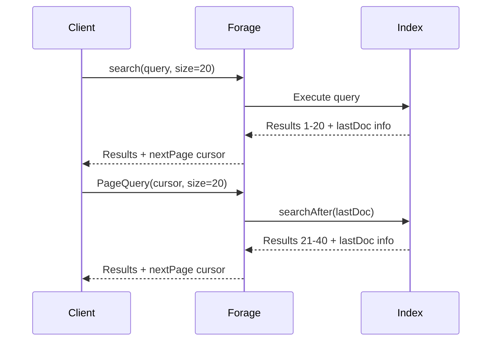

# Pagination

Forage provides cursor-based pagination for efficiently navigating large result sets.

## Basic Pagination

### First Page

```java
// Get first page of results
ForageQueryResult<Book> firstPage = engine.search(
    QueryBuilder.matchQuery("author", "rowling").buildForageQuery(15)
);

// Access results
List<MatchingResult<Book>> results = firstPage.getMatchingResults();
long totalHits = firstPage.getTotal().getValue();
String nextPageCursor = firstPage.getNextPage();
```

### Subsequent Pages

```java
// Get next page using cursor
if (firstPage.getNextPage() != null) {
    ForageQueryResult<Book> secondPage = engine.search(
        new PageQuery(firstPage.getNextPage(), 15)
    );
}
```

## Complete Example

```java
public class PaginatedSearch {

    private final SearchEngine<ForageQuery, ForageQueryResult<Book>> engine;

    public SearchResults search(String query, int pageSize, String cursor) {
        ForageQueryResult<Book> results;

        if (cursor == null) {
            // First page
            results = engine.search(
                QueryBuilder.matchQuery("title", query).buildForageQuery(pageSize)
            );
        } else {
            // Subsequent page
            results = engine.search(new PageQuery(cursor, pageSize));
        }

        return new SearchResults(
            results.getMatchingResults(),
            results.getTotal().getValue(),
            results.getNextPage()
        );
    }
}
```

## REST API Integration

```java
@Path("/search")
public class SearchResource {

    @GET
    public Response search(
            @QueryParam("q") String query,
            @QueryParam("page") String pageCursor,
            @QueryParam("size") @DefaultValue("20") int pageSize) {

        ForageQueryResult<Book> results;

        if (pageCursor == null || pageCursor.isEmpty()) {
            results = engine.search(
                QueryBuilder.matchQuery("title", query).buildForageQuery(pageSize)
            );
        } else {
            results = engine.search(new PageQuery(pageCursor, pageSize));
        }

        return Response.ok(new SearchResponse(
            results.getMatchingResults().stream()
                .map(MatchingResult::getData)
                .collect(Collectors.toList()),
            results.getTotal().getValue(),
            results.getNextPage()
        )).build();
    }
}
```

## Pagination with Sorting

```java
// Pagination works with custom sorting
ForageQueryResult<Book> page1 = engine.search(
    QueryBuilder.matchQuery("category", "fiction")
        .buildForageQuery(20, Arrays.asList(
            new SortCriteria("rating", SortOrder.DESC)
        ))
);

// Next page maintains the same sort order
ForageQueryResult<Book> page2 = engine.search(
    new PageQuery(page1.getNextPage(), 20)
);
```

## Pagination with Function Score

```java
// First page with function scoring
ForageQueryResult<Book> page1 = engine.search(
    QueryBuilder.functionScoreQuery()
        .baseQuery(QueryBuilder.matchQuery("genre", "fantasy").build())
        .fieldValueFactor("rating")
        .buildForageQuery(20, Arrays.asList(SortCriteria.byScore()))
);

// Subsequent pages
if (page1.getNextPage() != null) {
    ForageQueryResult<Book> page2 = engine.search(
        new PageQuery(page1.getNextPage(), 20)
    );
}
```

## How Cursor Pagination Works



The cursor contains:
- The last document's score and ID
- The original query string

This enables efficient "search after" pagination without offset overhead.

## Page Size Recommendations

| Use Case | Recommended Size |
|----------|------------------|
| Infinite scroll | 20-50 |
| Traditional pages | 10-25 |
| API responses | 20-100 |
| Data export | 100-500 |

## Handling End of Results

```java
public void iterateAllResults(String query) {
    String cursor = null;
    int pageSize = 100;

    do {
        ForageQueryResult<Book> page;
        if (cursor == null) {
            page = engine.search(
                QueryBuilder.matchQuery("title", query).buildForageQuery(pageSize)
            );
        } else {
            page = engine.search(new PageQuery(cursor, pageSize));
        }

        // Process results
        for (MatchingResult<Book> result : page.getMatchingResults()) {
            processBook(result.getData());
        }

        cursor = page.getNextPage();
    } while (cursor != null);
}
```

## Limitations

1. **No random access**: Can't jump to page 10 directly
2. **Forward only**: Can't go to previous page without storing cursors
3. **Consistency**: Results may shift if index is updated between pages

## Implementing Previous Page

Store cursors to enable backward navigation:

```java
public class PaginationState {
    private final Deque<String> cursorHistory = new ArrayDeque<>();

    public void recordCursor(String cursor) {
        if (cursor != null) {
            cursorHistory.push(cursor);
        }
    }

    public String getPreviousCursor() {
        if (cursorHistory.size() >= 2) {
            cursorHistory.pop(); // Remove current
            return cursorHistory.peek(); // Return previous
        }
        return null; // At first page
    }
}
```

## Related Topics

- [Sorting](../scoring/sorting.md) - Sort order affects pagination
- [Performance](performance.md) - Optimize for large result sets
