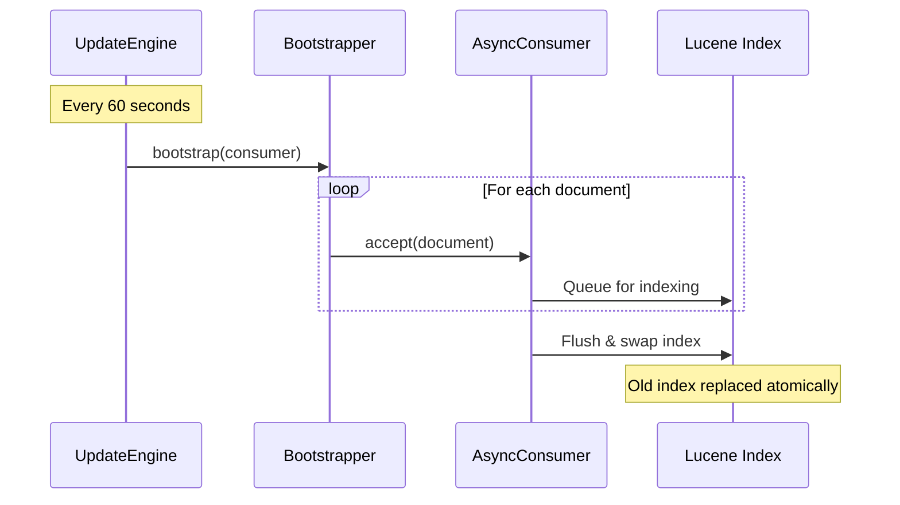
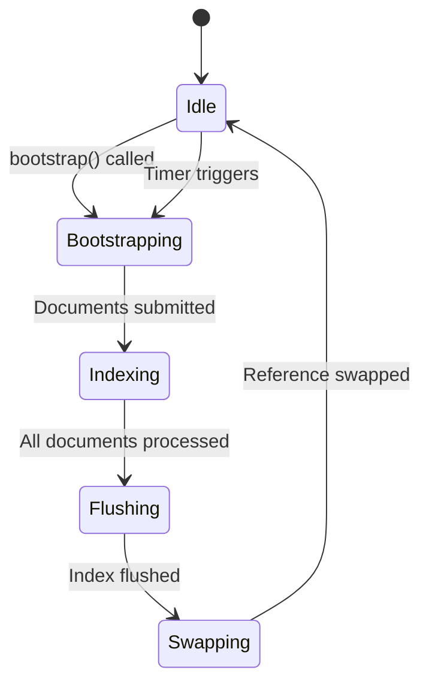

# Bootstrapping

Bootstrapping is the process of feeding data from your database into the Forage search index. This happens both at
startup and periodically to keep the index synchronized.

!!! important "Correctness"
    Ensure that your bootstrapper **ALWAYS** returns all values from your primary data store. <br><br>**Why?** <br>Internally, Forage creates a new Lucene index from scratch during each bootstrap cycle and then hot-swaps it in place. The IndexSearcher is immutable once created, to ensure that search queries are built for performance. Every bootstrap creates a new IndexSearcher, and cleans up the older one (garbage-collected). <br>If your bootstrapper returns only a subset of data, the index will be incomplete and search results will be incorrect.

## The Bootstrapper Interface

```java
public interface Bootstrapper<T> {
    void bootstrap(Consumer<T> consumer) throws Exception;
}
```

The `bootstrap` method receives a `Consumer` that accepts indexable documents. Your implementation iterates through your data and feeds each document to the consumer.

## Basic Implementation

```java
public class BookStore implements Bootstrapper<IndexableDocument> {

    private final BookRepository repository;

    @Override
    public void bootstrap(Consumer<IndexableDocument> consumer) {
        // Iterate through all data
        for (Book book : repository.findAll()) {
            // Create and submit indexable document
            consumer.accept(createDocument(book));
        }
    }

    private ForageDocument createDocument(Book book) {
        return new ForageDocument(book.getId(), Arrays.asList(
            new TextField("title", book.getTitle()),
            new TextField("author", book.getAuthor()),
            new FloatField("rating", new float[]{book.getRating()})
        ));
    }
}
```

## Streaming Large Datasets

For large datasets, use streaming to avoid loading everything into memory:

### JPA/Hibernate Streaming

```java
@Override
public void bootstrap(Consumer<IndexableDocument> consumer) {
    try (Stream<Book> bookStream = repository.streamAll()) {
        bookStream.forEach(book -> {
            consumer.accept(createDocument(book));
        });
    }
}
```

### JDBC Cursor

```java
@Override
public void bootstrap(Consumer<IndexableDocument> consumer) throws SQLException {
    try (Connection conn = dataSource.getConnection();
         PreparedStatement stmt = conn.prepareStatement(
             "SELECT * FROM books",
             ResultSet.TYPE_FORWARD_ONLY,
             ResultSet.CONCUR_READ_ONLY)) {

        stmt.setFetchSize(1000);  // Fetch in batches
        try (ResultSet rs = stmt.executeQuery()) {
            while (rs.next()) {
                Book book = mapResultSet(rs);
                consumer.accept(createDocument(book));
            }
        }
    }
}
```

### Batched Processing

```java
@Override
public void bootstrap(Consumer<IndexableDocument> consumer) {
    int pageSize = 1000;
    int page = 0;

    while (true) {
        List<Book> batch = repository.findAll(PageRequest.of(page, pageSize));
        if (batch.isEmpty()) {
            break;
        }

        batch.forEach(book -> consumer.accept(createDocument(book)));
        page++;
    }
}
```

## Periodic Updates

The `PeriodicUpdateEngine` manages automatic re-bootstrapping:

```java
// Create the update engine
PeriodicUpdateEngine<IndexableDocument> updateEngine = new PeriodicUpdateEngine<>(
    bootstrapper,                         // Your Bootstrapper implementation
    new AsyncQueuedConsumer<>(engine),    // Wraps the search engine
    60,                                   // Interval
    TimeUnit.SECONDS                      // Time unit
);

// Initial bootstrap
updateEngine.bootstrap();

// Start periodic updates
updateEngine.start();

// Later, when shutting down
updateEngine.stop();
```

### Update Behavior



## Error Handling

Handle errors gracefully during bootstrap:

```java
@Override
public void bootstrap(Consumer<IndexableDocument> consumer) {
    int successCount = 0;
    int errorCount = 0;

    for (Book book : repository.findAll()) {
        try {
            consumer.accept(createDocument(book));
            successCount++;
        } catch (Exception e) {
            log.error("Failed to index book {}: {}", book.getId(), e.getMessage());
            errorCount++;
        }
    }

    log.info("Bootstrap complete: {} indexed, {} errors", successCount, errorCount);
}
```

## Multi-Source Bootstrapping

Combine data from multiple sources:

```java
@Override
public void bootstrap(Consumer<IndexableDocument> consumer) {
    // Index books
    bookRepository.findAll().forEach(book ->
        consumer.accept(createBookDocument(book))
    );

    // Index magazines
    magazineRepository.findAll().forEach(magazine ->
        consumer.accept(createMagazineDocument(magazine))
    );
}

private ForageDocument createBookDocument(Book book) {
    return new ForageDocument("book-" + book.getId(), book, Arrays.asList(
        new TextField("title", book.getTitle()),
        new StringField("type", "BOOK")
    ));
}

private ForageDocument createMagazineDocument(Magazine magazine) {
    return new ForageDocument("magazine-" + magazine.getId(), magazine, Arrays.asList(
        new TextField("title", magazine.getTitle()),
        new StringField("type", "MAGAZINE")
    ));
}
```

## Performance Optimization

### 1. Parallel Processing

The consumer is thread-safe, so you can parallelize:

```java
@Override
public void bootstrap(Consumer<IndexableDocument> consumer) {
    List<Book> allBooks = repository.findAll();

    allBooks.parallelStream().forEach(book ->
        consumer.accept(createDocument(book))
    );
}
```

### 2. Minimize Field Processing

```java
// Expensive: compute during bootstrap
consumer.accept(new ForageDocument(book.getId(), book, Arrays.asList(
    new TextField("summary", generateSummary(book))  // Slow!
)));

// Better: pre-compute and store
consumer.accept(new ForageDocument(book.getId(), book, Arrays.asList(
    new TextField("summary", book.getCachedSummary())  // Fast
)));
```

### 3. Monitor Bootstrap Duration

```java
@Override
public void bootstrap(Consumer<IndexableDocument> consumer) {
    long startTime = System.currentTimeMillis();
    AtomicInteger count = new AtomicInteger();

    repository.findAll().forEach(book -> {
        consumer.accept(createDocument(book));
        count.incrementAndGet();
    });

    long duration = System.currentTimeMillis() - startTime;
    log.info("Bootstrapped {} documents in {} ms", count.get(), duration);
}
```

## Lifecycle



## Next Steps

- [Query Types](../queries/index.md) - Search your indexed data
- [Scoring & Ranking](../scoring/index.md) - Customize result ordering
