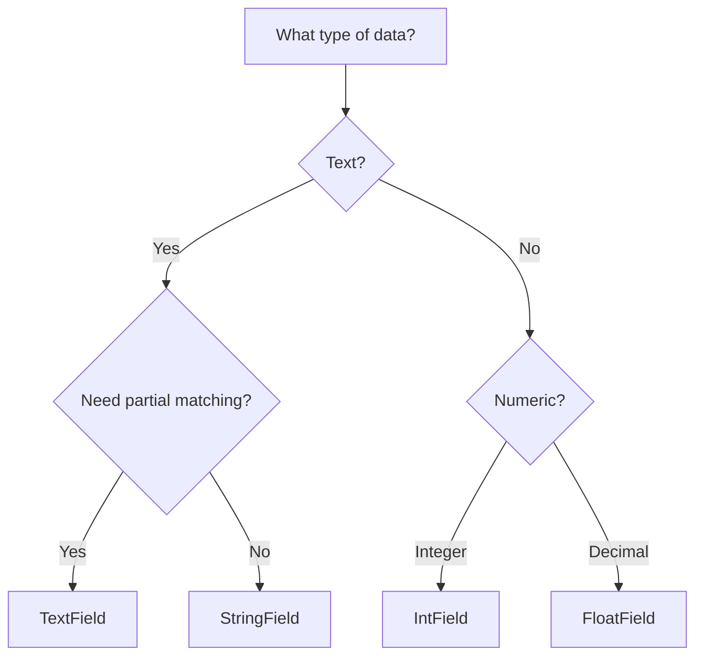

# Field Types

Forage provides several field types that map to Lucene field types. Choosing the right field type is crucial for both search functionality and performance.

## Field Types Overview

| Field Type    | Purpose          | Searchable | Sortable | Range Queries | Analysis     |
|---------------|------------------|------------|----------|---------------|--------------|
| `TextField`   | Full-text search | Yes        | No       | No            | Tokenized    |
| `StringField` | Exact matching   | Yes        | Yes      | No            | Not analyzed |
| `IntField`    | Integer values   | Yes        | Yes      | Yes           | Not analyzed |
| `FloatField`  | Decimal values   | Yes        | Yes      | Yes           | Not analyzed |

## TextField

Use `TextField` for content that needs full-text search with tokenization.

```java
new TextField("title", "The Quick Brown Fox")
```

### How It Works

The text is **analyzed** (tokenized, lowercased) before indexing:

```
Input: "The Quick Brown Fox"
       ↓ (analysis)
Tokens: ["the", "quick", "brown", "fox"]
```

### Search Behavior

```java
// Matches "The Quick Brown Fox"
QueryBuilder.matchQuery("title", "quick")      // ✓ Match
QueryBuilder.matchQuery("title", "QUICK")      // ✓ Match (case-insensitive)
QueryBuilder.matchQuery("title", "fox brown")  // ✓ Match (order doesn't matter)
QueryBuilder.matchQuery("title", "slowly")     // ✗ No match
```

### When to Use

- Article titles and content
- Product descriptions
- User-generated text
- Any content requiring partial matching

### Example

```java
fields.add(new TextField("title", book.getTitle()));
fields.add(new TextField("description", book.getDescription()));
fields.add(new TextField("author", book.getAuthor()));
```

## StringField

Use `StringField` for exact-match scenarios where the entire value should be treated as a single token.

```java
new StringField("isbn", "978-0134685991")
```

### How It Works

The text is stored **as-is** without analysis:

```
Input: "978-0134685991"
       ↓ (no analysis)
Token: ["978-0134685991"]
```

### Search Behavior

```java
// Only exact matches work
QueryBuilder.matchQuery("isbn", "978-0134685991")  // ✓ Match
QueryBuilder.matchQuery("isbn", "978")             // ✗ No match
QueryBuilder.matchQuery("isbn", "0134685991")      // ✗ No match
```

### When to Use

- IDs and codes (ISBN, SKU, product codes)
- Categories and tags (exact values)
- Status fields ("ACTIVE", "PENDING")
- Email addresses (for exact lookup)

### Example

```java
fields.add(new StringField("isbn", book.getIsbn()));
fields.add(new StringField("category", book.getCategory()));
fields.add(new StringField("status", book.getStatus().name()));
```

## IntField

Use `IntField` for integer numeric values.

```java
new IntField("pages", new int[]{350})
```

### Features

- **Range queries**: Find documents within a numeric range
- **Sorting**: Sort results by numeric value
- **DocValues**: Automatically stored for function scoring

### Search Behavior

```java
// Range query
QueryBuilder.intRangeQuery("pages", 200, 500).buildForageQuery()

// Can be used in function scoring
QueryBuilder.functionScoreQuery()
    .baseQuery(...)
    .fieldValueFactor("pages")
    .buildForageQuery()
```

### Multi-Value Support

```java
// A book might have multiple editions with different page counts
new IntField("pages", new int[]{350, 400, 425})
```

### When to Use

- Page counts, quantities
- Year, age
- Counts and totals
- Any whole number value

### Example

```java
fields.add(new IntField("pages", new int[]{book.getPages()}));
fields.add(new IntField("year", new int[]{book.getPublicationYear()}));
fields.add(new IntField("quantity", new int[]{book.getStockQuantity()}));
```

## FloatField

Use `FloatField` for decimal numeric values.

```java
new FloatField("rating", new float[]{4.7f})
```

### Features

- **Range queries**: Find documents within a decimal range
- **Sorting**: Sort by floating-point values
- **DocValues**: Available for function scoring and decay functions

### Search Behavior

```java
// Range query
QueryBuilder.floatRangeQuery("rating", 4.0f, 5.0f).buildForageQuery()

// Function scoring with field value
QueryBuilder.functionScoreQuery()
    .baseQuery(...)
    .fieldValueFactor("rating", 1.2f)  // Multiply field value by factor
    .buildForageQuery()

// Decay function
QueryBuilder.functionScoreQuery()
    .baseQuery(...)
    .scoreFunction(new DecayFunction(4.5, 0.5, 0.0, 0.5, DecayType.GAUSS, "rating"))
    .buildForageQuery()
```

### When to Use

- Ratings and scores
- Prices
- Percentages
- Coordinates (latitude/longitude)
- Any decimal value

### Example

```java
fields.add(new FloatField("rating", new float[]{book.getRating()}));
fields.add(new FloatField("price", new float[]{book.getPrice()}));
fields.add(new FloatField("discount", new float[]{book.getDiscountPercent()}));
```

## Field Type Decision Tree



## Combining Field Types

A typical document uses multiple field types:

```java
new ForageDocument(book.getId(), Arrays.asList(
    // Full-text searchable
    new TextField("title", book.getTitle()),
    new TextField("description", book.getDescription()),

    // Exact match
    new StringField("isbn", book.getIsbn()),
    new StringField("category", book.getCategory()),

    // Numeric - for ranges and sorting
    new IntField("pages", new int[]{book.getPages()}),
    new IntField("year", new int[]{book.getPublicationYear()}),

    // Numeric - for scoring and sorting
    new FloatField("rating", new float[]{book.getRating()}),
    new FloatField("price", new float[]{book.getPrice()})
));
```

## Performance Considerations

| Aspect        | TextField | StringField | IntField | FloatField |
|---------------|-----------|-------------|----------|------------|
| Index Size    | Large     | Medium      | Small    | Small      |
| Query Speed   | Medium    | Fast        | Fast     | Fast       |
| Memory Usage  | High      | Low         | Low      | Low        |
| Analysis Cost | High      | None        | None     | None       |

!!! tip "Optimization"
    - Use `StringField` instead of `TextField` when you don't need tokenization
    - Limit the number of `TextField` fields per document
    - Numeric fields are very efficient - use them for filtering and sorting

## Next Steps

- [Data Store](data-store.md) - Implement the Store interface
- [Bootstrapping](bootstrapping.md) - Feed documents into Forage
- [Query Types](../queries/index.md) - Search your indexed fields
