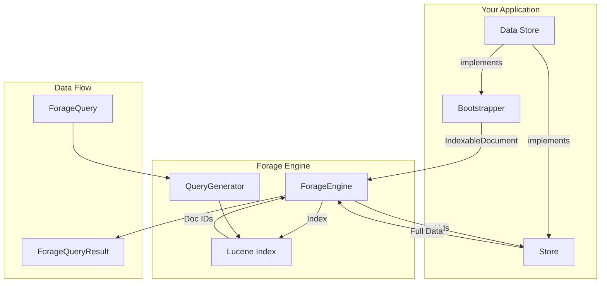

# Core Concepts

Understanding Forage's core concepts is essential for building effective search solutions. This section covers the fundamental building blocks.

## Architecture Overview



## Key Components

| Component | Purpose | Interface |
|-----------|---------|-----------|
| [Indexable Documents](indexable-documents.md) | Define what gets indexed | `IndexableDocument` |
| [Field Types](field-types.md) | Specify how data is analyzed | `TextField`, `StringField`, etc. |
| [Data Store](data-store.md) | Retrieve full data objects | `Store<D>` |
| [Bootstrapping](bootstrapping.md) | Feed data into the index | `Bootstrapper<T>` |

## The Search Flow

### 1. Indexing Phase

When bootstrapping occurs:

```java
// Your bootstrapper creates IndexableDocuments
consumer.accept(new ForageDocument(
    "book-123",           // Unique ID
    Arrays.asList(        // Fields to index
        new TextField("title", "Effective Java"),
        new TextField("author", "Joshua Bloch"),
        new FloatField("rating", new float[]{4.7f})
    )
));
```

Lucene then:

1. Analyzes text fields (tokenization, lowercasing, etc.)
2. Creates inverted indexes for fast lookup
3. Stores numeric fields for range queries and sorting


### 2. Query Phase

When a search is executed:

```java
ForageQueryResult<Book> results = engine.search(
    QueryBuilder.matchQuery("title", "java").buildForageQuery(10)
);
```

Forage:

1. Converts your query to a Lucene query
2. Executes against the in-memory index
3. Gets matching document IDs and scores
4. Calls your `Store.get()` to fetch full objects
5. Returns combined results

### 3. Update Phase

Periodically, the `PeriodicUpdateEngine`:

1. Triggers a new bootstrap
2. Builds a fresh index
3. Atomically swaps the old index with the new one
4. Old index is garbage collected

## Data Model

### ForageDocument

The primary indexable document type:

```java
public class ForageDocument implements IndexableDocument {
    private final String id;              // Unique identifier
    private final Object data;            // Original data object
    private final List<Field> fields;     // Indexed fields
}
```

### ForageQuery

The query abstraction:

```java
public interface ForageQuery {
    // Visitor pattern for different query types
    <T> T accept(ForageQueryVisitor<T> visitor);
}
```

### ForageQueryResult

Search results:

```java
public class ForageQueryResult<D> {
    private List<MatchingResult<D>> matchingResults;  // Matched documents
    private TotalResults total;                        // Total count
    private String nextPage;                           // Pagination cursor
}
```

### MatchingResult

Individual result with score:

```java
public class MatchingResult<D> {
    private String id;           // Document ID
    private D data;              // Full data object from Store
    private DocScore docScore;   // Relevance score
}
```

## Memory Model

Forage maintains the index entirely in JVM heap memory:

```
┌─────────────────────────────────────────────┐
│                JVM Heap                      │
│  ┌─────────────────────────────────────┐    │
│  │         Lucene Index                │    │
│  │  ┌──────────────────────────────┐   │    │
│  │  │    Inverted Index (Terms)    │   │    │
│  │  │    ─────────────────────     │   │    │
│  │  │    "java" → [doc1, doc5]     │   │    │
│  │  │    "code" → [doc2, doc3]     │   │    │
│  │  └──────────────────────────────┘   │    │
│  │  ┌──────────────────────────────┐   │    │
│  │  │    DocValues (Numerics)      │   │    │
│  │  │    ─────────────────────     │   │    │
│  │  │    rating: [4.7, 4.4, 4.5]   │   │    │
│  │  └──────────────────────────────┘   │    │
│  │  ┌──────────────────────────────┐   │    │
│  │  │    Stored Fields (IDs)       │   │    │
│  │  └──────────────────────────────┘   │    │
│  └─────────────────────────────────────┘    │
│                                             │
│  ┌─────────────────────────────────────┐    │
│  │      Your Data Store Reference      │    │
│  │      (for Store.get() calls)        │    │
│  └─────────────────────────────────────┘    │
└─────────────────────────────────────────────┘
```

!!! tip "Memory Planning"
    Plan for 2-4x your raw data size in heap memory. The multiplier depends on:

    - Number of text fields (more = more memory)
    - Average document size
    - Text analysis complexity

## Thread Safety

Forage is designed for concurrent access:

- **Read operations**: Fully thread-safe, multiple threads can search simultaneously
- **Write operations**: Handled by the `AsyncQueuedConsumer` which serializes writes
- **Index swap**: Atomic reference swap ensures readers always see a consistent index

## Next Steps

Dive deeper into each concept:

- [Indexable Documents](indexable-documents.md) - How to structure your data for indexing
- [Field Types](field-types.md) - Choosing the right field type
- [Data Store](data-store.md) - Implementing the Store interface
- [Bootstrapping](bootstrapping.md) - Feeding data into Forage
