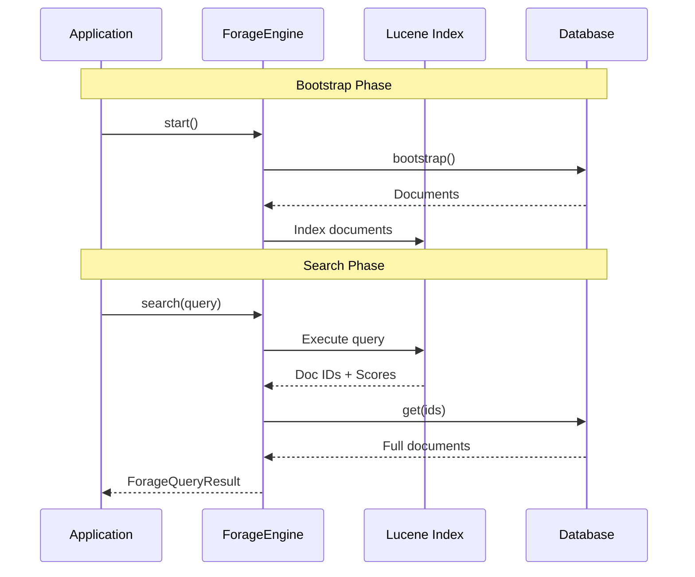

# Overview

## What is Forage?

Forage is a Java library that creates an in-memory search index from your existing database. It
wraps [Apache Lucene](https://lucene.apache.org/) to provide powerful full-text search capabilities without requiring a
dedicated search infrastructure.

## The Problem

When you have a small to medium dataset and need search capabilities, traditional approaches have significant drawbacks:

| Approach                                          | Problem                                                                        |
|---------------------------------------------------|--------------------------------------------------------------------------------|
| **Dedicated Search Engine** (Elasticsearch, Solr) | Overkill for small datasets, expensive to operate, adds operational complexity |
| **Database Indexes**                              | Limited to exact matches, no full-text search, bloats your database            |
| **LIKE Queries**                                  | Slow, no relevance scoring, no fuzzy matching                                  |

## The Solution

Forage solves this by:

1. **Creating an in-memory Lucene index** in each application node
2. **Periodically syncing** with your database to stay up-to-date
3. **Providing a simple API** to define indexing rules and execute searches

## How It Works

### Architecture


The library operates in four phases:

### 1. Bootstrapping

When your application starts, Forage scans your database and builds the initial search index:

```java

@Override
public void bootstrap(Consumer<IndexableDocument> consumer) {
    // Scan your database
    for (Book book : getAllBooksFromDatabase()) {
        // Create indexable documents
        consumer.accept(createIndexableDocument(book));
    }
}
```

### 2. Periodic Updates

A background thread periodically re-bootstraps from your database to capture changes:

```java
PeriodicUpdateEngine<IndexableDocument> updateEngine =
        new PeriodicUpdateEngine<>(
                dataStore,
                new AsyncQueuedConsumer<>(searchEngine),
                60, TimeUnit.SECONDS  // Refresh every 60 seconds
        );
updateEngine.start();
```

### 3. Indexing Rules

You define which fields are searchable and how they should be analyzed:

```java
new ForageDocument(book.getId(), Arrays.asList(
        new TextField("title", book.getTitle()),        // Full-text searchable
        new TextField("author", book.getAuthor()),      // Full-text searchable
        new StringField("genre", book.getGenre()),      // Exact match only
        new FloatField("rating", book.getRating()),     // Numeric, sortable
        new IntField("pages", book.getPages())          // Numeric, range queries
));
```

### 4. Search Queries

Execute searches using the fluent `QueryBuilder` API:

```java
ForageQueryResult<Book> results = searchEngine.search(
        QueryBuilder.booleanQuery()
                .query(QueryBuilder.matchQuery("title", "programming").boost(2.0f).build())
                .query(QueryBuilder.matchQuery("author", "martin").build())
                .clauseType(ClauseType.SHOULD)
                .buildForageQuery(10)
);
```

## Data Flow



## Key Components

### Bootstrapper

The `Bootstrapper<IndexableDocument>` interface is how you feed data into Forage:

```java
public interface Bootstrapper<T> {
    void bootstrap(Consumer<T> consumer) throws Exception;
}
```

### Store

The `Store<D>` interface retrieves full data objects given their IDs:

```java
public interface Store<D> {
    Map<String, D> get(List<String> ids);
}
```

### ForageQuery

The query abstraction that supports multiple query types:

- `MatchQuery` - Term matching
- `BooleanQuery` - Combine queries
- `RangeQuery` - Numeric ranges
- `FuzzyMatchQuery` - Typo tolerance
- `PhraseMatchQuery` - Exact phrases
- `PrefixMatchQuery` - Prefix matching
- `FunctionScoreQuery` - Custom scoring

### ForageQueryResult

Search results containing:

- `matchingResults` - List of matched documents with scores
- `total` - Total number of matches
- `nextPage` - Cursor for pagination

## Prerequisites

Before using Forage, ensure:

1. **Data Accessibility**: You can scan/stream all data from your database
2. **Memory Capacity**: You have sufficient heap space (2-4x your raw data size)
3. **Java 17+**: Forage requires Java 17 or later

## Limitations

| Limitation               | Details                                                                                                              |
|--------------------------|----------------------------------------------------------------------------------------------------------------------|
| **Dataset Size**         | Optimized for up to ~1 million documents                                                                             |
| **Memory Bound**         | Index must fit in JVM heap                                                                                           |
| **Single Node**          | No distributed search (each node has its own index)                                                                  |
| **Eventual Consistency** | Changes reflect after the next bootstrap cycle                                                                       |
| **Database workload**    | Every bootstrap, must necessarily get all documents from the primary datastore. This may not be incremental changes. |

## Next Steps

- [Installation Guide](getting-started/installation.md) - Add Forage to your project
- [Quick Start](getting-started/quick-start.md) - Build your first search engine
- [Core Concepts](core-concepts/index.md) - Deep dive into Forage concepts
