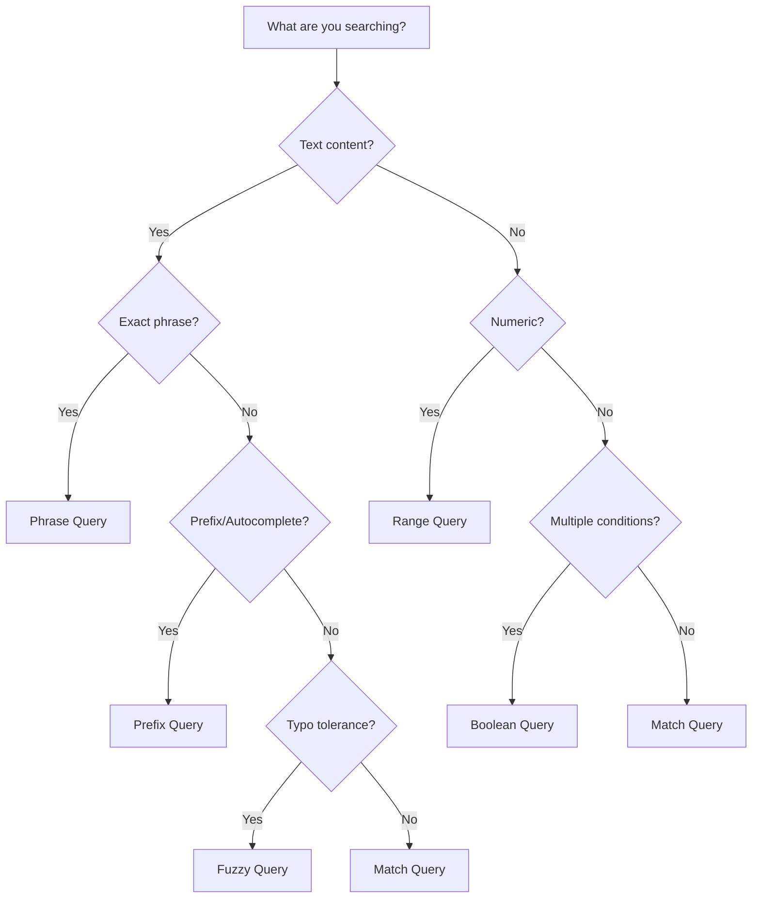

# Query Types

Forage provides a rich set of query types to search your indexed data. All queries are built using the fluent `QueryBuilder` API.

## Query Overview

| Query Type | Purpose | Example Use Case |
|------------|---------|------------------|
| [Match Query](match-query.md) | Term matching | Search by keyword |
| [Boolean Query](boolean-query.md) | Combine queries | AND/OR/NOT logic |
| [Range Query](range-query.md) | Numeric ranges | Price filters |
| [Fuzzy Query](fuzzy-query.md) | Typo tolerance | User search input |
| [Phrase Query](phrase-query.md) | Exact phrases | "machine learning" |
| [Prefix Query](prefix-query.md) | Prefix matching | Autocomplete |
| [Match All Query](match-all-query.md) | All documents | Browse all |

## Quick Reference

```java
import com.livetheoogway.forage.models.query.util.QueryBuilder;

// Match Query - find documents with term in field
QueryBuilder.matchQuery("title", "java").buildForageQuery()

// Boolean Query - combine multiple queries
QueryBuilder.booleanQuery()
    .query(QueryBuilder.matchQuery("title", "java").build())
    .query(QueryBuilder.matchQuery("author", "bloch").build())
    .clauseType(ClauseType.MUST)
    .buildForageQuery()

// Range Query - numeric range filter
QueryBuilder.intRangeQuery("pages", 100, 500).buildForageQuery()
QueryBuilder.floatRangeQuery("rating", 4.0f, 5.0f).buildForageQuery()

// Fuzzy Query - typo-tolerant search
QueryBuilder.fuzzyMatchQuery("title", "jva").buildForageQuery()

// Phrase Query - exact phrase match
QueryBuilder.phraseMatchQuery("title", "clean code").buildForageQuery()

// Prefix Query - prefix matching
QueryBuilder.prefixMatchQuery("author", "mart").buildForageQuery()

// Match All - return all documents
QueryBuilder.matchAllQuery().buildForageQuery()
```

## Building Queries

### ForageQuery vs Search Query

Forage uses two query levels:

1. **Search Query** - The query logic (what to match)
2. **ForageQuery** - Wraps search query with pagination and sorting

```java
// Create a search query
MatchQuery searchQuery = QueryBuilder.matchQuery("title", "java").build();

// Convert to ForageQuery with options
ForageQuery forageQuery = searchQuery.buildForageQuery(
    10,                                          // Max results
    Arrays.asList(SortCriteria.byScore()),      // Sort criteria
    0.5f                                         // Minimum score
);

// Execute search
ForageQueryResult<Book> results = engine.search(forageQuery);
```

### buildForageQuery Options

```java
// Simple - just max results (default: 100)
QueryBuilder.matchQuery("title", "java").buildForageQuery()
QueryBuilder.matchQuery("title", "java").buildForageQuery(10)

// With sorting
QueryBuilder.matchQuery("title", "java")
    .buildForageQuery(10, Arrays.asList(SortCriteria.byScore(SortOrder.DESC)))

// With sorting and minimum score
QueryBuilder.matchQuery("title", "java")
    .buildForageQuery(10, Arrays.asList(SortCriteria.byScore()), 0.5f)
```

## Query Boosting

All queries support boosting to influence relevance:

```java
// Boost title matches higher than author matches
QueryBuilder.booleanQuery()
    .query(QueryBuilder.matchQuery("title", "java").boost(2.0f).build())
    .query(QueryBuilder.matchQuery("author", "java").boost(1.0f).build())
    .clauseType(ClauseType.SHOULD)
    .buildForageQuery()
```

See [Query Boosts](../scoring/query-boosts.md) for details.

## Query Decision Tree



## Common Patterns

### Search with Filters

```java
// Search "java" in title, filter by rating >= 4.0
QueryBuilder.booleanQuery()
    .query(QueryBuilder.matchQuery("title", "java").build())
    .query(QueryBuilder.floatRangeQuery("rating", 4.0f, 5.0f).build())
    .clauseType(ClauseType.MUST)
    .buildForageQuery()
```

### Multi-Field Search

```java
// Search across multiple fields
QueryBuilder.booleanQuery()
    .query(QueryBuilder.matchQuery("title", "programming").build())
    .query(QueryBuilder.matchQuery("description", "programming").build())
    .query(QueryBuilder.matchQuery("author", "programming").build())
    .clauseType(ClauseType.SHOULD)  // Match any field
    .buildForageQuery()
```

### Exclusion Filter

```java
// Find programming books, exclude "beginner" level
QueryBuilder.booleanQuery()
    .query(QueryBuilder.matchQuery("category", "programming").build())
    .query(QueryBuilder.matchQuery("level", "beginner")
        .clauseType(ClauseType.MUST_NOT).build())
    .clauseType(ClauseType.MUST)
    .buildForageQuery()
```

## Next Steps

Explore each query type in detail:

- [Match Query](match-query.md) - Basic term matching
- [Boolean Query](boolean-query.md) - Combining queries
- [Range Query](range-query.md) - Numeric filtering
- [Fuzzy Query](fuzzy-query.md) - Typo tolerance
- [Phrase Query](phrase-query.md) - Exact phrases
- [Prefix Query](prefix-query.md) - Autocomplete
- [Match All Query](match-all-query.md) - All documents
