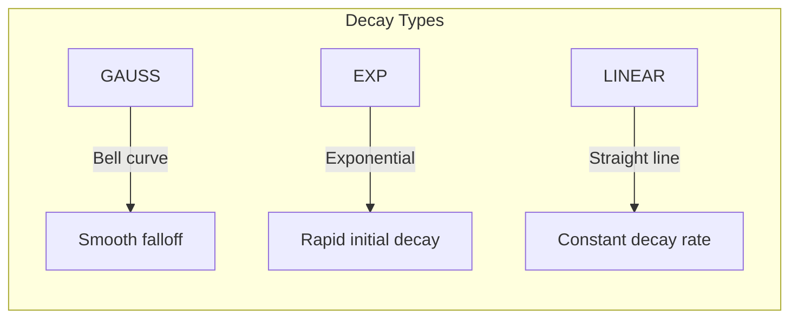

# Function Score

Function Score queries allow you to modify document scores using custom functions, field values, mathematical expressions, or decay functions.

## Basic Usage

```java
QueryBuilder.functionScoreQuery()
    .baseQuery(QueryBuilder.matchQuery("title", "java").build())
    .fieldValueFactor("rating")
    .buildForageQuery(10)
```

## Function Types

| Function | Mode | Score Calculation |
|----------|------|-------------------|
| `ConstantScoreFunction` | Direct | `score = constant` |
| `WeightedScoreFunction` | Multiplicative | `score = base_score × weight` |
| `FieldValueFactorFunction` | Direct | `score = field_value × factor` |
| `ScriptScoreFunction` | Multiplicative | `score = base_score × expression_result` |
| `RandomScoreFunction` | Direct | `score = random(seed, field)` |
| `DecayFunction` | Direct | `score = decay(distance)` |

## Constant Score Function

Assigns a fixed score to all matching documents, ignoring the base query's relevance.

```java
QueryBuilder.functionScoreQuery()
    .baseQuery(QueryBuilder.matchQuery("category", "fiction").build())
    .constantScore(5.0f)  // All matches get score = 5.0
    .buildForageQuery()
```

**Use case**: When relevance doesn't matter, only matching does.

```java
// All fiction books get the same score
var fictionBooks = engine.search(
    QueryBuilder.functionScoreQuery()
        .baseQuery(QueryBuilder.matchQuery("category", "fiction").build())
        .constantScore(1.0f)
        .buildForageQuery(100)
);
```

## Weighted Score Function

Multiplies the base query score by a weight factor.

```java
QueryBuilder.functionScoreQuery()
    .baseQuery(QueryBuilder.matchQuery("title", "programming").build())
    .scoreFunction(new WeightedScoreFunction(2.0f))  // Score × 2
    .buildForageQuery()
```

**Use case**: Scale relevance scores without changing ranking order.

```java
// Double all scores (useful when combining with other scoring)
QueryBuilder.functionScoreQuery()
    .baseQuery(QueryBuilder.matchQuery("title", "java").build())
    .scoreFunction(new WeightedScoreFunction(2.0f))
    .buildForageQuery()
```

## Field Value Factor Function

Uses a numeric field's value as the score, optionally multiplied by a factor.

```java
// Score = rating
QueryBuilder.functionScoreQuery()
    .baseQuery(QueryBuilder.matchAllQuery().build())
    .fieldValueFactor("rating")
    .buildForageQuery()

// Score = rating × 1.5
QueryBuilder.functionScoreQuery()
    .baseQuery(QueryBuilder.matchAllQuery().build())
    .fieldValueFactor("rating", 1.5f)
    .buildForageQuery()
```

**Use case**: Rank by a business metric (rating, popularity, sales).

```java
// Top rated books
var topRated = engine.search(
    QueryBuilder.functionScoreQuery()
        .baseQuery(QueryBuilder.matchAllQuery().build())
        .fieldValueFactor("rating")
        .buildForageQuery(20)
);

// Results ordered: 4.9, 4.8, 4.7, 4.5, ...
```

## Script Score Function

Executes a JavaScript expression that can reference the base score and document fields.

```java
// Score = base_relevance × rating
QueryBuilder.functionScoreQuery()
    .baseQuery(QueryBuilder.matchQuery("title", "programming").build())
    .scoreFunction(new ScriptScoreFunction("score * rating"))
    .buildForageQuery()
```

### Available Variables

| Variable | Description |
|----------|-------------|
| `score` | Base query relevance score |
| `<fieldName>` | Any numeric DocValues field |

### Expression Examples

```java
// Blend relevance with rating
new ScriptScoreFunction("score * rating")

// Weighted combination
new ScriptScoreFunction("score * 0.7 + rating * 0.3")

// Complex formula
new ScriptScoreFunction("score * (1 + ln(popularity + 1))")

// Multiple fields
new ScriptScoreFunction("score * rating * freshness")
```

**Use case**: Create custom ranking formulas combining multiple signals.

```java
// E-commerce: blend relevance, rating, and recency
var products = engine.search(
    QueryBuilder.functionScoreQuery()
        .baseQuery(QueryBuilder.matchQuery("name", searchTerm).build())
        .scoreFunction(new ScriptScoreFunction("score * rating * recencyBoost"))
        .buildForageQuery(20)
);
```

## Random Score Function

Generates deterministic pseudo-random scores for consistent shuffling.

```java
QueryBuilder.functionScoreQuery()
    .baseQuery(QueryBuilder.matchAllQuery().build())
    .scoreFunction(new RandomScoreFunction(
        42L,           // seed (same seed = same order)
        "id_numeric"   // field for randomization
    ))
    .buildForageQuery(10)
```

**Use case**: A/B testing, showing variety, avoiding bias.

```java
// Show random selection to user (consistent per session)
long sessionSeed = session.getId().hashCode();
var randomPicks = engine.search(
    QueryBuilder.functionScoreQuery()
        .baseQuery(QueryBuilder.matchQuery("category", "featured").build())
        .scoreFunction(new RandomScoreFunction(sessionSeed, "id_numeric"))
        .buildForageQuery(5)
);
```

## Decay Function

Scores decrease based on distance from an origin value. Three decay types available.

```java
QueryBuilder.functionScoreQuery()
    .baseQuery(QueryBuilder.matchAllQuery().build())
    .scoreFunction(new DecayFunction(
        origin,      // Optimal value (score = 1.0 at origin)
        scale,       // Distance at which score = decay
        offset,      // No decay within this distance
        decay,       // Score at scale distance (e.g., 0.5)
        decayType,   // GAUSS, EXP, or LINEAR
        field        // Numeric field name
    ))
    .buildForageQuery()
```

### Decay Types



| Type | Formula | Character |
|------|---------|-----------|
| `GAUSS` | Gaussian bell curve | Smooth, natural falloff |
| `EXP` | Exponential decay | Rapid initial drop |
| `LINEAR` | Linear decrease | Constant rate |

### Decay Examples

```java
// Prefer books around 300 pages (± 50 pages is OK)
new DecayFunction(
    300.0,          // origin: ideal page count
    100.0,          // scale: score = 0.5 at 100 pages away
    50.0,           // offset: no decay within 50 pages
    0.5,            // decay: score at scale distance
    DecayType.GAUSS,
    "numPages"
)

// Prefer recent items (date as epoch seconds)
new DecayFunction(
    System.currentTimeMillis() / 1000.0,  // now
    86400 * 7,                             // scale: 7 days
    86400,                                 // offset: 1 day grace period
    0.5,
    DecayType.EXP,
    "publishedAt"
)
```

**Use case**: Location-based search, time-sensitive content, optimal value matching.

```java
// Find medium-length books (prefer ~300 pages)
var mediumBooks = engine.search(
    QueryBuilder.functionScoreQuery()
        .baseQuery(QueryBuilder.matchQuery("category", "programming").build())
        .scoreFunction(new DecayFunction(300.0, 100.0, 0.0, 0.5, DecayType.GAUSS, "numPages"))
        .buildForageQuery(10)
);
```

## Top-Level Boost

Apply a final multiplier to the function score result:

```java
QueryBuilder.functionScoreQuery()
    .baseQuery(QueryBuilder.matchQuery("title", "java").build())
    .fieldValueFactor("rating")
    .boost(1.5f)  // Final score × 1.5
    .buildForageQuery()
```

## Complete Examples

### E-Commerce Product Ranking

```java
// Combine text relevance with business signals
ForageQuery productQuery = QueryBuilder.functionScoreQuery()
    .baseQuery(QueryBuilder.booleanQuery()
        .query(QueryBuilder.matchQuery("name", searchTerm).boost(3.0f).build())
        .query(QueryBuilder.matchQuery("brand", searchTerm).boost(2.0f).build())
        .query(QueryBuilder.matchQuery("description", searchTerm).build())
        .clauseType(ClauseType.SHOULD)
        .build())
    .scoreFunction(new ScriptScoreFunction("score * rating * (1 + ln(salesCount + 1))"))
    .boost(1.0f)
    .buildForageQuery(20, Arrays.asList(SortCriteria.byScore()), 0.1f);
```

### Content Freshness

```java
// Boost recent articles
long now = Instant.now().getEpochSecond();
ForageQuery freshContent = QueryBuilder.functionScoreQuery()
    .baseQuery(QueryBuilder.matchQuery("content", searchTerm).build())
    .scoreFunction(new DecayFunction(
        now,           // origin: now
        86400 * 30,    // scale: 30 days
        86400 * 7,     // offset: 7 day grace
        0.5,           // decay to 0.5
        DecayType.EXP,
        "publishedAt"
    ))
    .buildForageQuery(15);
```

### Popularity-Based Discovery

```java
// Browse by popularity only
ForageQuery popular = QueryBuilder.functionScoreQuery()
    .baseQuery(QueryBuilder.matchQuery("category", "technology").build())
    .fieldValueFactor("viewCount")
    .buildForageQuery(10);
```

## Field Requirements

Function scoring requires numeric DocValues fields:

```java
// In your document creation
new ForageDocument(item.getId(), item, Arrays.asList(
    // These can be used in function scoring:
    new FloatField("rating", new float[]{item.getRating()}),
    new IntField("popularity", new int[]{item.getPopularity()}),
    new FloatField("price", new float[]{item.getPrice()})
));
```

## Related Topics

- [Query Boosts](query-boosts.md) - Simpler field-level boosting
- [Sorting](sorting.md) - Explicit result ordering
- [API Reference: Score Functions](../api/score-functions.md) - Detailed API
