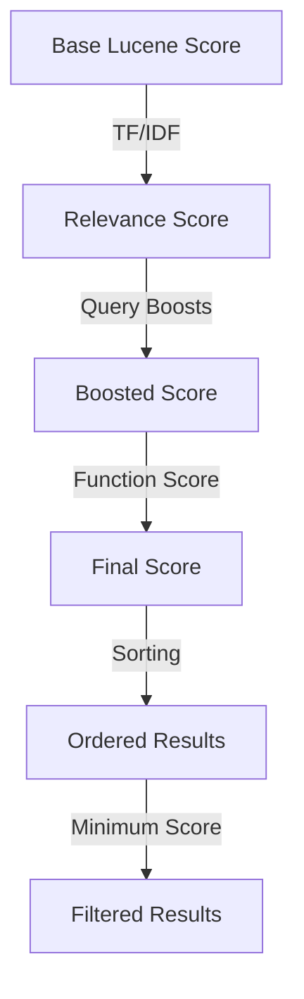

# Scoring & Ranking

Forage provides powerful tools to control how search results are ranked. You can combine Lucene's relevance scoring with business signals to create the perfect ranking for your use case.

## Ranking Layers



## Ranking Components

| Component | Purpose | Documentation |
|-----------|---------|---------------|
| [Query Boosts](query-boosts.md) | Emphasize specific query clauses | Boost important fields |
| [Function Score](function-score.md) | Apply custom scoring functions | Field values, scripts, decay |
| [Sorting](sorting.md) | Order results by criteria | Score, field values |
| [Minimum Score](minimum-score.md) | Filter low-quality results | Quality threshold |

## Quick Examples

### Query-Level Boosting

```java
// Title matches are 2x more important than author matches
QueryBuilder.booleanQuery()
    .query(QueryBuilder.matchQuery("title", "java").boost(2.0f).build())
    .query(QueryBuilder.matchQuery("author", "java").boost(1.0f).build())
    .clauseType(ClauseType.SHOULD)
    .buildForageQuery()
```

### Rank by Field Value

```java
// Rank by rating (highest rated first)
QueryBuilder.functionScoreQuery()
    .baseQuery(QueryBuilder.matchAllQuery().build())
    .fieldValueFactor("rating")
    .buildForageQuery(20)
```

### Combine Relevance with Business Signal

```java
// Blend text relevance with rating
QueryBuilder.functionScoreQuery()
    .baseQuery(QueryBuilder.matchQuery("title", "programming").build())
    .scoreFunction(new ScriptScoreFunction("score * rating"))
    .buildForageQuery(10)
```

### Custom Sorting

```java
// Sort by score, then by rating as tiebreaker
QueryBuilder.matchQuery("title", "java")
    .buildForageQuery(10, Arrays.asList(
        SortCriteria.byScore(SortOrder.DESC),
        new SortCriteria("rating", SortOrder.DESC)
    ))
```

### Quality Threshold

```java
// Only return results with score >= 0.5
QueryBuilder.matchQuery("title", "programming")
    .buildForageQuery(10, null, 0.5f)
```

## Scoring Modes

Function scores operate in two modes:

| Mode | Formula | Use Case |
|------|---------|----------|
| **Multiplicative** | `base_score × function_value` | Scale relevance by weight |
| **Direct Value** | `function_value` | Replace score with field value |

```java
// Multiplicative: WeightedScoreFunction, ScriptScoreFunction
// final_score = relevance_score × weight
QueryBuilder.functionScoreQuery()
    .baseQuery(QueryBuilder.matchQuery("title", "java").build())
    .scoreFunction(new WeightedScoreFunction(2.0f))  // Score × 2

// Direct Value: FieldValueFactorFunction, ConstantScoreFunction
// final_score = field_value (ignores base relevance)
QueryBuilder.functionScoreQuery()
    .baseQuery(QueryBuilder.matchAllQuery().build())
    .fieldValueFactor("rating")  // Score = rating
```

## Function Score Types

| Function | Mode | Description |
|----------|------|-------------|
| `ConstantScoreFunction` | Direct | All matches get same score |
| `WeightedScoreFunction` | Multiplicative | Scale base score by weight |
| `FieldValueFactorFunction` | Direct | Use field value as score |
| `ScriptScoreFunction` | Multiplicative | Custom JavaScript expression |
| `RandomScoreFunction` | Direct | Deterministic random order |
| `DecayFunction` | Direct | Distance-based decay |

## Common Ranking Recipes

### E-Commerce Product Search

```java
// Combine relevance + rating + recency
QueryBuilder.functionScoreQuery()
    .baseQuery(QueryBuilder.booleanQuery()
        .query(QueryBuilder.matchQuery("name", searchTerm).boost(3.0f).build())
        .query(QueryBuilder.matchQuery("description", searchTerm).build())
        .clauseType(ClauseType.SHOULD)
        .build())
    .scoreFunction(new ScriptScoreFunction("score * rating * recencyBoost"))
    .buildForageQuery(20, Arrays.asList(SortCriteria.byScore()), 0.1f)
```

### Content Discovery (Popularity-Based)

```java
// Rank purely by popularity
QueryBuilder.functionScoreQuery()
    .baseQuery(QueryBuilder.matchQuery("category", "technology").build())
    .fieldValueFactor("viewCount")
    .buildForageQuery(10)
```

### Location-Based (Decay)

```java
// Prefer items closer to target value
QueryBuilder.functionScoreQuery()
    .baseQuery(QueryBuilder.matchAllQuery().build())
    .scoreFunction(new DecayFunction(
        targetDistance,  // origin
        10.0,            // scale
        0.0,             // offset
        0.5,             // decay
        DecayType.GAUSS,
        "distance"
    ))
    .buildForageQuery(20)
```

### A/B Testing (Random)

```java
// Consistent random order for A/B testing
long seed = userId.hashCode();
QueryBuilder.functionScoreQuery()
    .baseQuery(QueryBuilder.matchAllQuery().build())
    .scoreFunction(new RandomScoreFunction(seed, "id_numeric"))
    .buildForageQuery(10)
```

## Next Steps

Explore each ranking component:

- [Query Boosts](query-boosts.md) - Field and clause boosting
- [Function Score](function-score.md) - All function types explained
- [Sorting](sorting.md) - Sort criteria and ordering
- [Minimum Score](minimum-score.md) - Quality filtering
